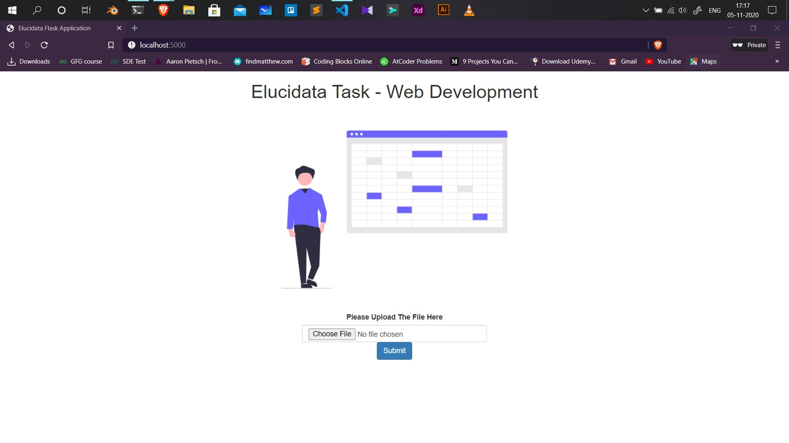

# Elucidata Task made using Flask :tada: :rocket:
A simple flask application for the assignment of web development internship .
I have developed the application using flask and python , the end user can upload the file and perform the tasks mentioned on the assesment , I have used pandas for the processing of the excel file

## Folder structure
- **web** : This folder contains the static file of the project like images , css etc
- **templates** : Contains the UI part of the application , served by flask
- **server.py** : Main file for spinning up the server and perform operations

## Setup project locally
```
git clone https://github.com/avijeetpandey/elucidata-task.git

cd elucidata-task

pip install -r requirements.txt

python server.py

This will spin up a flask server
```


## Important details :rocket:
- The file uploaded will be saved into the **uploads** folder
- **Server PORT : 5000**

## API endpoints :muscle:

- [ ] **/ :** home of the application where user can upload the file 
- [ ] **/filter :** This end point filter based **LPC,PC,Plasmalogen** and returns user a zip file containing the output **(Task 1)**
- [ ] **/retention :** This endpoint rounds of the Times and returns a csv file which contains mean of the column as specified **(Task 2 and 3)**


## UI of the application 
As mentioned I have tried to keep the UI of the application as minimal as possible 


## It was fun working on the challenge , i really enjoyed , looking forward to hear from you soon , Thanks